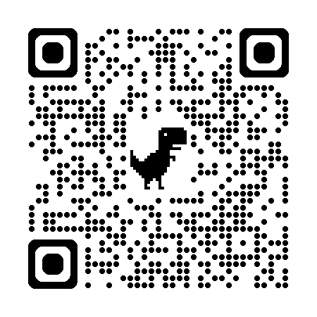

# 
Doom de Wish

 
 

<v-clicks>

- <h1>Pas de son </h1>
- <h1> Monochrome </h1>
- <h1> Portrait mode </h1>
- <h1> ~ 10 fps </h1>

</v-clicks>

::right::

# 
Mais...

 
 

<v-clicks>

- <h1>Level up en C</h1>
- <h1>❤️ X-Compilation (c'est faux)</h1>
- <h1>Coder avec des limitations</h1>
- <h1>Internet Culture</h1>

</v-clicks>

---
layout: two-cols
---

# 
MOUSTAPHA AGACK

##### _Smash my keyboard for a living—results vary, but sometimes cool stuff happens_

 

##### Full Stack Engineer at  and 

 

  

##### <logos-bluesky class="social-icon"/> moussto

##### <mdi-github class="social-icon"/> moussto

##### <logos-twitter class="social-icon"/> mousstoh

##### <logos-linkedin-icon class="social-icon"/> moustapha-agack

  

  

    

    
OpenFeedback

  

###### <streamline-computer-screen-1-screen-device-electronics-monitor-diplay-computer class="source-icon"/>[moussto/talk-k4-doom-slides](https://github.com/Moussto/talk-k4-doom-slides/)

###### <streamline-programming-script-file-code-1-code-files-angle-programming-file-bracket class="source-icon"/>[moussto/k4-doom](https://github.com/Moussto/k4-doom)

::right::

###### S/O <streamline-hearts-symbol />

|                                  |                                                                                                                                      |                                                                                |
| -------------------------------- | ------------------------------------------------------------------------------------------------------------------------------------ | ------------------------------------------------------------------------------ |
| Game Engine Black Book DOOM      | [Fabien Sanglard](https://fabiensanglard.net/gebbdoom/)                                                                              | <streamline-interface-content-book-content-books-book-close/>                  |
| Kindle Developer's Corner        | [Mobilereads.com](https://www.mobileread.com/forums/forumdisplay.php?f=150)                                                          | <streamline-interface-layout-2-column-header-layout-layouts-masthead-sidebar/> |
| Doomgeneric                      | [ozkl/doomgeneric](https://github.com/ozkl/doomgeneric)                                                                              | <streamline-code-monitor-1 />                                                  |
| Toolchain Types                  | [Crosstool-NG](https://crosstool-ng.github.io/docs/toolchain-types/)                                                                 | <streamline-interface-file-text-text-common-file />                            |
| Kindle Hacks                     | [Sotiris Papatheodorou](https://git.sr.ht/~sotirisp/kindle-hacks)                                                                    | <streamline-code-monitor-1 />                                                  |
| Dithering Eleven Algorithms      | [Tanner Helland](https://tannerhelland.com/2012/12/28/dithering-eleven-algorithms-source-code.html)                                  | <streamline-interface-file-text-text-common-file />                            |
| Error Diffusion Dithering        | [Computerphile](https://www.youtube.com/watch?v=ico4fJfohMQ)                                                                         | <streamline-computer-logo-youtube-youtube-clip-social-video/>                  |
| Dithering for Eink Display Panel | [Daiyu Ko](https://community.nxp.com/t5/i-MX-Processors-Knowledge-Base/Dithering-Implementation-for-Eink-Display-Panel/ta-p/1100219) | <streamline-interface-layout-2-column-header-layout-layouts-masthead-sidebar/> |
| Zenika Friends 🙏🏽                |                                                                                                                                      |                                                                                |

 
 
 
 

    <PoweredBySlidev class="slidev-thanks"/>

---
layout: full
dragPos:
  square: 594,271,324,174
---

# 
DIAGNOSTIC SLIDE

<RenderWhen context="visible" class="stream-on-term-container">
    <StreamOnTerminal/>
</RenderWhen>

 

<AudioDiagnostic />

